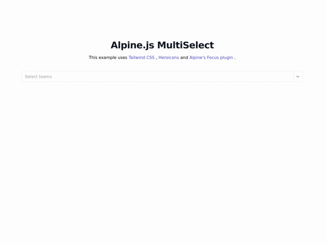

# alpinejs-multiselect
Alpine.js MultiSelect component

## Features
- Configurable pre-selected option
- Fast search
- Configurable searching values
- Custom template
- No other JS dependencies

## Dependency
- [Apline.js](https://alpinejs.dev/essentials/installation)

### [Demo](https://alexpechkarev.github.io/alpinejs-multiselect/)




## Installation

Install [Apline.js](https://alpinejs.dev/essentials/installation).

The example uses [Alpine's Focus plugin](https://alpinejs.dev/plugins/focus), this is optional.

Specify your select element, `data-search` attribute value used to match against the search string, ignoring upper/lower case differences.

```html
<select style="display:none;" id="multSelect">
    <option value="te_1" data-search="arsenal">Arsenal</option>
    <option value="te_3" data-search="Tottenham Hotspur Spurs">Spurs</option>
    <option value="te_3" data-search="Manchester City">Man City</option>
    ...
</select>
```

Initiate the Apline.js component, pre-selected options can be defined by initializing `selected` property with an array of values. `elementId` references the select element `id` defined above.

```html
 <div class="w-full" x-data="alpineMuliSelect({selected:['te_11', 'te_12'], elementId:'multSelect'})">
 ```

Add the Alpine component code into your application.

 ```javascript
 document.addEventListener("alpine:init", () => {
    Alpine.data("alpineMuliSelect", (obj) => ({
        elementId: obj.elementId,
        options: [],
        selected: obj.selected,
        selectedElms: [],
        show: false,
        search: '',
        open() {
            this.show = true
        },
        close() {
            this.show = false
        },
        toggle() {
            this.show = !this.show
        },
        isOpen() {
            return this.show === true
        },
        
        // Initializing component 
        init() {
            const options = document.getElementById(this.elementId).options;
            for (let i = 0; i < options.length; i++) {

                this.options.push({
                    value:  options[i].value,
                    text:   options[i].innerText,
                    search: options[i].dataset.search,
                    selected: Object.values(this.selected).includes(options[i].value)
                });

                if (this.options[i].selected) {
                    this.selectedElms.push(this.options[i])
                }
            }

            // searching for the given value
            this.$watch("search", (e => {
                this.options = []
                const options = document.getElementById(this.elementId).options;
                Object.values(options).filter((el) => {
                    var reg = new RegExp(this.search, 'gi');
                    return el.dataset.search.match(reg)
                }).forEach((el) => {
                    let newel = {
                        value: el.value,
                        text: el.innerText,
                        search: el.dataset.search,
                        selected: Object.values(this.selected).includes(el.value)
                    }
                    this.options.push(newel);
                })
            }));
        },
        // clear search field
        clear() {
            this.search = ''
        },
        // deselect selected options
        deselect() {
            setTimeout(() => {
                this.selected = []
                this.selectedElms = []
                Object.keys(this.options).forEach((key) => {
                    this.options[key].selected = false;
                })
            }, 100)
        },
        // select given option
        select(index, event) {
            if (!this.options[index].selected) {
                this.options[index].selected = true;
                this.options[index].element = event.target;
                this.selected.push(this.options[index].value);
                this.selectedElms.push(this.options[index]);

            } else {
                this.selected.splice(this.selected.lastIndexOf(index), 1);
                this.options[index].selected = false
                Object.keys(this.selectedElms).forEach((key) => {
                    if (this.selectedElms[key].value == this.options[index].value) {
                        setTimeout(() => {
                            this.selectedElms.splice(key, 1)
                        }, 100)
                    }
                })
            }
        },
        // remove from selected option
        remove(index, option) {
            this.selectedElms.splice(index, 1);
            Object.keys(this.options).forEach((key) => {
                if (this.options[key].value == option.value) {
                    this.options[key].selected = false;
                    Object.keys(this.selected).forEach((skey) => {
                        if (this.selected[skey] == option.value) {
                            this.selected.splice(skey, 1);
                        }
                    })
                }
            })
        },
        // filter out selected elements
        selectedElements() {
            return this.options.filter(op => op.selected === true)
        },
        // get selected values
        selectedValues() {
            return this.options.filter(op => op.selected === true).map(el => el.value)
        }
    }));
});
 ```

## Support
-------
[Please open an issue on GitHub](https://github.com/alexpechkarev/alpinejs-multiselect/issues)


## Licence
-------
Released under the MIT Licence. See the bundled
[LICENCE](https://github.com/alexpechkarev/alpinejs-multiselect/blob/main/LICENSE)
file for details.